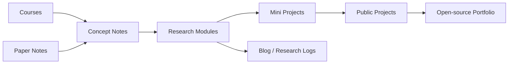

## Research Modules

Open research spaces for long-term technical learning and project development.

| Module | Focus |
| --- | --- |
| [Brain-Computer Interfaces](research-modules/brain-computer-interfaces/) | Neural signals, decoding, EEG, electrophysiology, fMRI, functional ultrasound, and neural interface systems. |
| [Representation Learning](research-modules/representation-learning/) | Latent spaces, manifolds, alignment, transfer learning, JEPA, world models, replay, and neural population dynamics. |

## What This Lab Contains

- [Courses](courses/) for GitHub, mathematics, machine learning, computational neuroscience, signal processing, and scientific writing.
- [Paper Notes](paper-notes/) organized by Neuroscience, AI, NeuroAI, and Methods.
- [Projects](projects/) for published work, open-source tools, and portfolio projects.
- [Blog](blog/) for research logs, weekly learning notes, and early ideas.

## Current Focus

- **Neural decoding and BCI**: comparing signal modalities and building practical decoding pipelines.
- **Representation learning**: studying latent spaces, manifolds, and transferable representations.
- **NeuroAI**: connecting biological learning principles with artificial learning systems.
- **Open research workflow**: maintaining reusable notes, templates, mini projects, and public research artifacts.

## Research Workflow

## Start Here

- [Research Modules](research-modules/) for roadmaps and focused research direction.
- [Courses](courses/) for structured learning.
- [Paper Notes](paper-notes/) for literature maps.
- [Projects](projects/) for public outputs.
- [About](about/) for CV, contact, and research statement.
